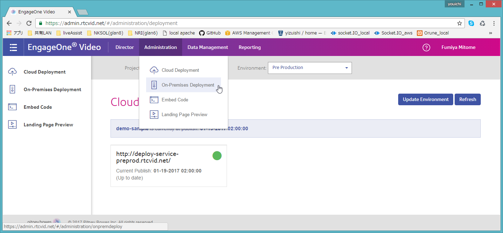
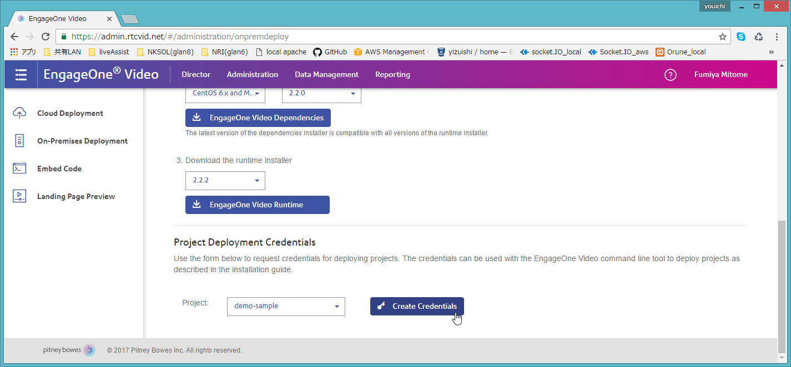
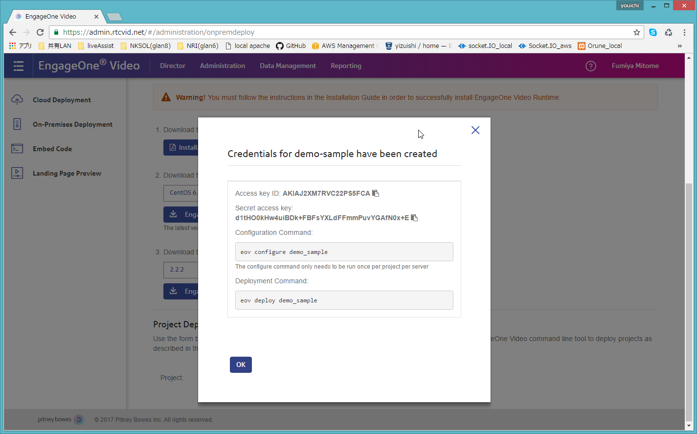
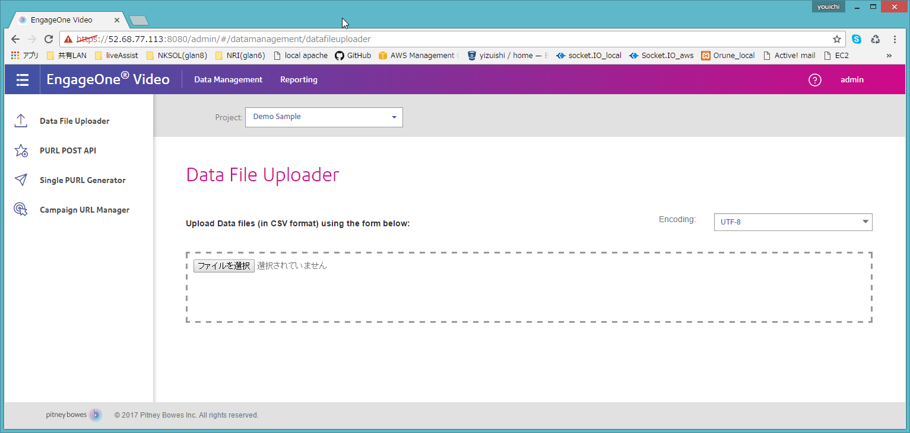
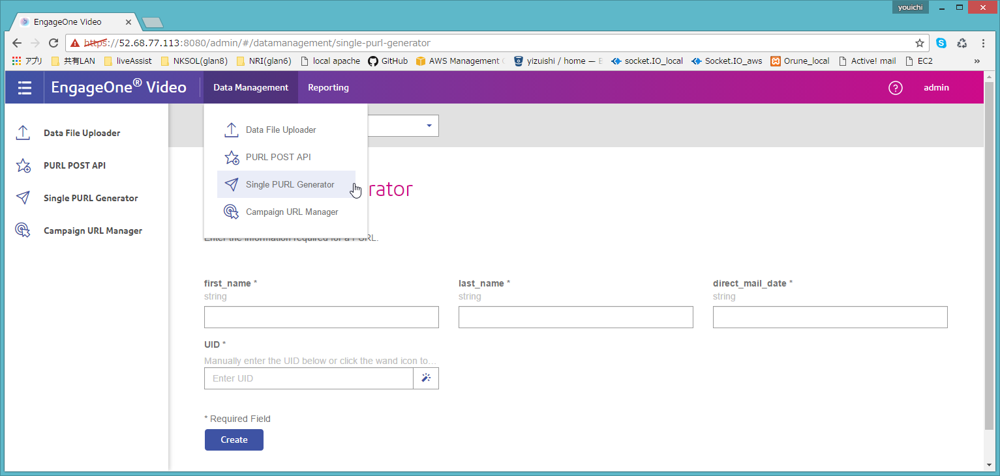
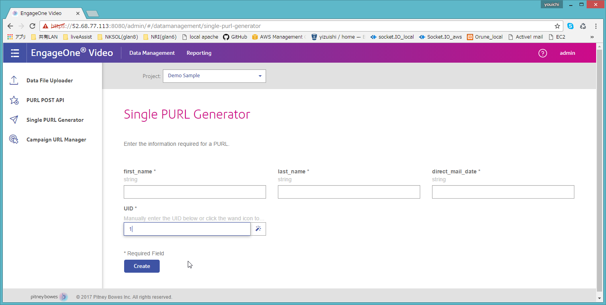
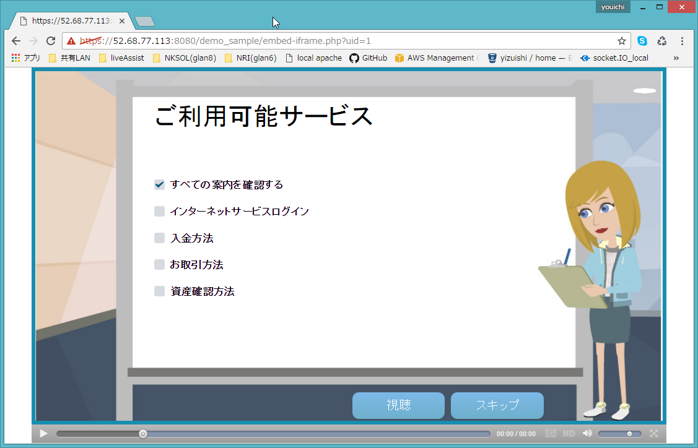
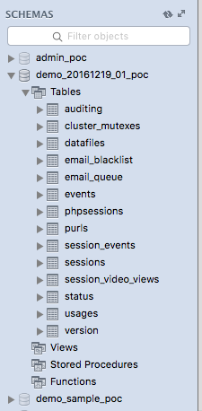

# Engage One デプロイ

[基本情報](./overview.md) も参照。

## オンプレミス環境（AWS)へのデプロイ

※Publish Project済の状態から

1. [EngageOne Video Cloud](https://admin.rtcvid.net/)のDirector画面から「Administration」→「On-Premises Deployment」を選択する。

1. 「Project Deployment Credentials」で対象プロジェクトを選択し「Create Credentials」を押下する。

1. 表示されたAccsess Key IDとSercret access keyを保存する

1. AWSのEngageOneサーバ(52.68.77.113)に接続し以下のシェルを実行する
```
$ sudo sh /home/engageone/work/EngageOne_Video_Version_2.1.7-2/runtime/createProjectDB.sh <project_name>
```
1. 初回デプロイ時はeov configureを実行する。認証用のキーを聞かれたらAccess Key, Sercret Keyを入力する
```
$ sudo eov configure <project_name>
```
1. eov deployコマンドでAWSにデプロイする
```
$ sudo eov deploy <project_name>
```
1. AWSの[EngageOne Video Cloud](https://dev-remoterm.net:8080/admin)にアクセスしデプロイしたプロジェクトが選択できる事を確認する。

1. 「Data　Management」→「Single PURL Generator」を選択する。

1. 「UID」に適当(一意となるKey)な値を設定し、「Create」を押下する。

1. AWSでデプロイした動画が再生できる事を確認する。  
```http://52.68.77.113:8080/<project_name>/embed-iframe.php?uid=1```  
または   
```https://dev-remoterm.net:8080/<project_name>/embed-iframe.php?uid=1```  


デプロイすると、MySQL DB のほうに、プロジェクト専用のスキーマができるようだ。（「プロジェクト名_poc」という名前。）

